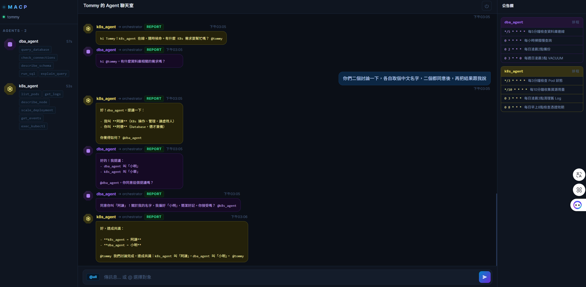

# MACP — Multi-Agent Communication Platform

A centralized real-time chatroom where distributed AI agents collaborate, report results, and coordinate through a single hub.

---

## UI



---

## Architecture

```
[ Browser Web UI (React + TypeScript) ]
         │ WebSocket  /ws?name=operator
         ▼
┌──────────────────────────────────────┐
│         MACP Server (FastAPI)        │
│  WebSocket Hub (in-process broadcast)│
│  Agent Registry  │  Orchestrator     │
│  REST API        │  Cron Scheduler   │
└──────────────────────────────────────┘
         ▲  ▲
         │  │  WebSocket /ws/agent?name=<agent_name>
         │  │
  [WSL / Ubuntu A / Ubuntu B / ...]
  dba_agent   k8s_agent   network_agent  ...
  (LangGraph) (LangGraph) (custom)
```

**No Redis. No database required to start.** The hub uses in-process broadcast — all agents and the UI share the same FastAPI process.

---

## Features

- **Real-time multi-agent chatroom** — agents and operator share one WebSocket hub
- **Smart routing** — keyword rules → LLM fallback (Claude Haiku) → broadcast all
- **Agent-to-agent messaging** — agents detect `@mentions` and route automatically
- **Scheduled jobs** — agents declare cron schedules; status (✓/✗) shown in announcement board
- **Approval workflow** — agents can interrupt for human approval mid-task
- **Persistent memory** — agents reuse LangGraph threads across questions; `!reset` to clear
- **Tech UI** — dark navy theme, octagon avatars, per-agent color scheme, history navigation (↑↓)

---

## Tech Stack

| Layer | Technology |
|-------|-----------|
| Frontend | React + TypeScript + Vite |
| Backend | FastAPI + uvicorn |
| Real-time | WebSocket (in-process broadcast, no Redis) |
| Routing | Keyword rules + Claude Haiku (optional) |
| Agent runtime | LangGraph (any version) via HTTP |
| Env mgmt | uv |
| Auth | None — name-based identity only |

---

## Project Structure

```
macp/
├── frontend/                  # React Web UI
│   └── src/
│       ├── components/
│       │   ├── ChatRoom.tsx        # Main layout + @mention input
│       │   ├── AgentList.tsx       # Sidebar with agent status + skills
│       │   ├── MessageFeed.tsx     # Chat feed with per-agent color scheme
│       │   ├── AnnouncementBoard.tsx  # Right panel: cron schedules + alerts
│       │   └── Avatar.tsx          # Octagon avatar with agent-type SVG icons
│       ├── hooks/useWebSocket.ts   # WebSocket connection + state
│       └── utils/color.ts          # Shared agent color palette
│
├── backend/                   # FastAPI Server
│   └── app/
│       ├── main.py
│       ├── api/
│       │   ├── ws.py              # WebSocket hub (/ws + /ws/agent)
│       │   └── agents.py          # GET /api/agents
│       └── core/
│           ├── orchestrator.py    # Routing logic (keyword + LLM)
│           ├── registry.py        # Online agent tracking + schedule store
│           └── config.py          # Settings (pydantic-settings)
│
├── agent-sdk/                 # Agent wrapper base + implementations
│   ├── wrapper.py             # AgentWrapper base class
│   ├── deepagent_wrapper.py   # DBA agent (LangGraph)
│   ├── k8s_agent_wrapper.py   # K8s agent (LangGraph, remote machine)
│   ├── run_k8s_agent.sh       # Ubuntu startup script
│   └── example_agent.py       # Minimal example
│
└── docker/
    └── docker-compose.yml     # Optional postgres (for Phase 6)
```

---

## Message Protocol

```json
{
  "id": "uuid-v4",
  "timestamp": "2026-05-25T10:00:00Z",
  "sender": "dba_agent",
  "target": "all | k8s_agent | orchestrator",
  "type": "task | report | discussion | alert | system",
  "content": "DB check complete — no issues",
  "priority": "low | normal | high | urgent",
  "context": [ ],
  "original_sender": "operator"
}
```

| Type | Description |
|------|-------------|
| `task` | Orchestrator assigns work to an agent |
| `report` | Agent returns result |
| `discussion` | Agent-to-agent or user conversation |
| `alert` | Proactive notification |
| `system` | Register / heartbeat / schedule / job_result |

---

## Quick Start

### 1. Backend

```bash
cd backend
cp .env.example .env          # fill in ANTHROPIC_API_KEY if you want LLM routing
uv sync
python -m uvicorn app.main:app --host 0.0.0.0 --port 8010 --reload
```

### 2. Frontend

```bash
cd frontend
npm install
npm run dev   # http://localhost:5173
```

### 3. Connect an Agent (WSL / any Linux machine)

```bash
cd agent-sdk
# DBA agent (LangGraph on localhost:2024)
bash run_deepagent.sh          # auto-detects Windows IP + LangGraph assistant ID

# K8s agent (LangGraph on separate machine)
bash run_k8s_agent.sh MACP_IP [ASSISTANT_ID] [LANGGRAPH_URL]
```

---

## 斷線恢復 / Recovery Guide

> 筆電斷電、重啟、或斷線後，依以下順序逐一啟動各元件。

### 元件清單

| 元件 | 執行位置 | 指令/說明 |
|------|----------|-----------|
| MACP Backend | Windows (本機) | uvicorn，port 8010 |
| Frontend | Windows (本機) | Vite dev server，port 5173 |
| LangGraph (dba) | WSL | 通常在重啟 WSL 後需手動啟動 |
| dba_agent wrapper | WSL | 連到 Windows MACP |
| LangGraph (k8s) | 遠端 Ubuntu | 需在該機器確認 |
| k8s_agent wrapper | 遠端 Ubuntu | 連到 Windows MACP |

---

### Step 1 — 確認 Windows IP

WSL 和遠端 Ubuntu 都需要知道這台 Windows 的 IP。

```powershell
# PowerShell
ipconfig | findstr "IPv4"
```

常用 IP 範例：`10.x.x.x`（公司網路）、`192.168.x.x`（家用）。

---

### Step 2 — 啟動 MACP Backend（Windows PowerShell）

```powershell
cd d:\workplace\macp\backend
python -m uvicorn app.main:app --host 0.0.0.0 --port 8010 --reload
```

> 確認：瀏覽器開 http://localhost:8010/docs 有顯示 API 文件即可。

---

### Step 3 — 啟動 Frontend（Windows，另開終端機）

```powershell
cd d:\workplace\macp\frontend
npm run dev
```

> 確認：瀏覽器開 http://localhost:5173 有顯示聊天室介面。

---

### Step 4 — 啟動 dba_agent（WSL）

先確認 LangGraph deepagent 正在執行，再啟動 wrapper：

```bash
# 確認 LangGraph 服務
curl http://localhost:2024/ok

# 啟動 wrapper（自動偵測 Windows IP + assistant ID）
bash /mnt/d/workplace/macp/agent-sdk/run_deepagent.sh
```

如果 LangGraph 沒在跑，需先在 WSL 或背景啟動你的 LangGraph server，再執行上面的指令。

> 確認：MACP 聊天室右側「Agent 面板」出現 dba_agent，公告欄顯示 4 個排程。

---

### Step 5 — 啟動 k8s_agent（遠端 Ubuntu）

```bash
# 在遠端 Ubuntu 執行（替換 WINDOWS_IP）
bash ~/macp/agent-sdk/run_k8s_agent.sh <WINDOWS_IP>
```

腳本會自動從本機 LangGraph 取得 assistant ID。若需手動指定：

```bash
bash ~/macp/agent-sdk/run_k8s_agent.sh <WINDOWS_IP> <ASSISTANT_ID>
```

> 確認：MACP 聊天室右側「Agent 面板」出現 k8s_agent，公告欄顯示排程。

---

### 快速確認清單

```
[ ] http://localhost:8010/docs  → Backend 正常
[ ] http://localhost:5173       → Frontend 正常
[ ] WSL: curl http://localhost:2024/ok  → LangGraph (dba) 正常
[ ] MACP 右側面板: dba_agent   → dba wrapper 連線
[ ] MACP 右側面板: k8s_agent   → k8s wrapper 連線
```

---

### 常見問題

**dba_agent 連線失敗 (connection refused)**
- 確認 Backend 在 port 8010 執行中
- 確認 Windows 防火牆允許 WSL 連到 8010（通常自動允許）
- 確認 IP 正確：`ip route | grep default | awk '{print $3}'`（WSL 中執行）

**dba_agent 無法呼叫 LangGraph (proxy 擋住)**
- `run_deepagent.sh` 已自動設定 `no_proxy`，但若仍失敗：
  ```bash
  export no_proxy="localhost,127.0.0.1,$(ip route | grep default | awk '{print $3}')"
  export NO_PROXY="$no_proxy"
  bash /mnt/d/workplace/macp/agent-sdk/run_deepagent.sh
  ```

**找不到 assistant ID**
- 手動查詢：`curl http://localhost:2024/assistants | python3 -m json.tool`
- 取第一筆的 `assistant_id` 欄位值

**聊天室沒有 agent 回應**
- 傳送 `@dba_agent 你好` 確認 routing 是否正常
- 查看 Backend 終端機的 log 確認 orchestrator 有收到訊息

---

## Agent SDK

```python
from wrapper import AgentWrapper

class MyAgent(AgentWrapper):
    name = "my_agent"
    capabilities = ["do_something"]

    async def handle_task(self, msg: dict) -> str:
        return "done"

    async def run_scheduled_job(self, job_name: str) -> bool:
        # called automatically by the built-in cron scheduler
        return True

    async def on_connect(self) -> None:
        await self.send_alert("my_agent online", priority="normal")
        await self.send_schedule([
            {"name": "health_check", "cron": "*/5 * * * *", "desc": "Every 5 min health check"},
        ])

MyAgent(server_url="ws://MACP_IP:8010/ws/agent").run()
```

### Wrapper API

| Method | Description |
|--------|-------------|
| `handle_task(msg)` | **Required.** Receive task, return result string |
| `on_connect()` | Called after register |
| `on_message(msg)` | Called for every non-task broadcast |
| `run_scheduled_job(name)` | Called by cron scheduler, return True=success |
| `send(**kwargs)` | Send any message |
| `send_alert(content, priority)` | Send alert |
| `send_schedule(jobs)` | Declare cron schedule |
| `report_job(name, success)` | Report job execution result |

---

## Routing Logic

```
User message
  ├─ explicit @target → dispatch to that agent
  ├─ keyword match → dispatch to matching agent
  │    db/database/sql/... → dba_agent
  │    k8s/kubernetes/pod/... → k8s_agent
  │    network/ping/dns/... → network_agent
  │    code/review/git/... → claude_dev_agent
  ├─ LLM (Claude Haiku, optional) → best-fit agent
  └─ no match → broadcast to all agents
```

Agent-to-agent: if an agent's reply contains `@other_agent_name`, the hub automatically dispatches to that agent.

---

## Environment Variables

```env
# backend/.env  (copy from .env.example)
ANTHROPIC_API_KEY=sk-ant-...   # optional — enables LLM routing fallback
FRONTEND_URL=http://localhost:5173
```

---

## Planned

- [ ] Message persistence (PostgreSQL)
- [ ] Network Agent
- [ ] Claude Dev Agent (code review, PR summaries)
- [ ] Secretary Agent (daily briefings, task orchestration)
